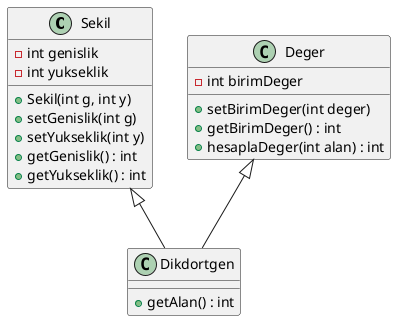

### Kodun Amacı ve Kurgu

Bu örnekte, **Nesne Yönelimli Programlama (OOP)** prensiplerini kullanarak bir **Dikdörtgen** sınıfı ve onu yöneten yardımcı sınıflar (Sekil ve Deger) oluşturulmuştur. Bu kurgu, OOP'nin temel özelliklerini kullanarak daha modüler, genişletilebilir ve sürdürülebilir bir yapıyı hedefler.

### 1. **Sekil Sınıfı**

* **Temel Özellikler**: `Sekil` sınıfı, her geometrik şeklin ortak özelliklerine sahip bir temel sınıf olarak tasarlanmıştır. Bu sınıf, dikdörtgenin **genişlik** ve **yükseklik** gibi temel özelliklerini tanımlar.
* **Getter ve Setter Kullanımı**: Kullanıcı, `setGenislik` ve `setYukseklik` fonksiyonları aracılığıyla bu değerleri ayarlayabilirken, `getGenislik` ve `getYukseklik` fonksiyonları ile bu değerlere erişebilir.
* **Kapsülleme (Encapsulation)**: `genislik` ve `yukseklik` değişkenleri **private** olarak tanımlanarak doğrudan dışarıdan erişim engellenmiştir. Bu verilere sadece sınıf içindeki belirli fonksiyonlar üzerinden erişilebilir, bu da **veri güvenliği** sağlar.

### 2. **Deger Sınıfı**

* **Birim Değer ve Hesaplama**: `Deger` sınıfı, dikdörtgenin fiyatını hesaplamak için kullanılan bir sınıftır. Her dikdörtgenin birim değeri (`birimDeger`) vardır ve bu birim değer, alan ile çarpılarak fiyat hesaplanır.
* **Modülerlik**: Fiyat hesaplama işlemi, **`getDeger()`** fonksiyonu tarafından yapılır ve bu, dışarıdan müdahale edilmeden sadece gerekli fonksiyonla yapılabilir. Bu modülerlik, **tek bir sorumluluk prensibi (Single Responsibility Principle)** ile uyumludur.
* **Kapsülleme**: `birimDeger` değişkeni **private** olarak tanımlanmıştır, yani dışarıdan doğrudan erişilemez. Değer yalnızca belirli metodlar ile ayarlanabilir ve alınabilir.

### 3. **Dikdortgen Sınıfı**

* **Kalıtım (Inheritance)**: `Dikdortgen` sınıfı, **`Sekil`** ve **`Deger`** sınıflarından kalıtım alır. Bu, **çoklu kalıtım** özelliğini kullanarak dikdörtgenin hem geometrik özelliklerini (genişlik ve yükseklik) hem de fiyat bilgisini aynı sınıf içinde birleştirir.
* **Alan Hesaplama**: `getAlan()` fonksiyonu, **`Sekil`** sınıfından miras alınan `genislik` ve `yukseklik` değişkenlerini kullanarak dikdörtgenin alanını hesaplar.

### 4. **Ana Program**

* **Dikdörtgen Nesnesi**: `Dikdortgen` sınıfından bir nesne (`D1`) oluşturulur ve `setGenislik` ile `setYukseklik` fonksiyonları aracılığıyla genişlik ve yükseklik değerleri atanır.
* **Alan Hesaplama**: `getAlan()` fonksiyonu çağrılarak dikdörtgenin alanı hesaplanır.
* **Fiyat Hesaplama**: `Deger` sınıfındaki `getDeger()` fonksiyonu ile alan ve birim değer kullanılarak dikdörtgenin fiyatı hesaplanır.
* **Veri Ekrana Yazdırma**: Alan ve fiyat, ekrana yazdırılır.

### Genel Kurgu ve OOP Prensipleri

1. **Kalıtım (Inheritance)**: `Dikdortgen` sınıfı, `Sekil` ve `Deger` sınıflarından miras alarak, her iki sınıfın işlevlerini kullanabilmektedir.
2. **Kapsülleme (Encapsulation)**: Sınıf üyeleri (`genislik`, `yukseklik`, `birimDeger`) **private** olarak tanımlanmış, dışarıdan erişim kısıtlanmış ve yalnızca belirli fonksiyonlar ile erişim sağlanmıştır.
3. **Modülerlik**: Her sınıfın kendine özgü sorumluluğu vardır. `Sekil` sınıfı sadece geometrik verileri, `Deger` sınıfı ise fiyat hesaplamayı yapar. Bu modüler yapı, kodun daha yönetilebilir ve sürdürülebilir olmasını sağlar.
4. **Esneklik ve Genişletilebilirlik**: Bu yapı, farklı şekiller (örneğin, kare, daire) ve daha fazla özellik (örneğin, renk, tip) eklenerek kolayca genişletilebilir.
