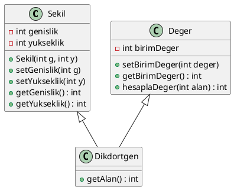

```plantuml
@startuml
class Sekil {
    -int genislik
    -int yukseklik
    +Sekil(int g, int y)
    +setGenislik(int g)
    +setYukseklik(int y)
    +getGenislik() : int
    +getYukseklik() : int
}

class Deger {
    -int birimDeger
    +setBirimDeger(int deger)
    +getBirimDeger() : int
    +hesaplaDeger(int alan) : int
}

class Dikdortgen {
    +getAlan() : int
}

Sekil <|-- Dikdortgen
Deger <|-- Dikdortgen

@enduml
```

